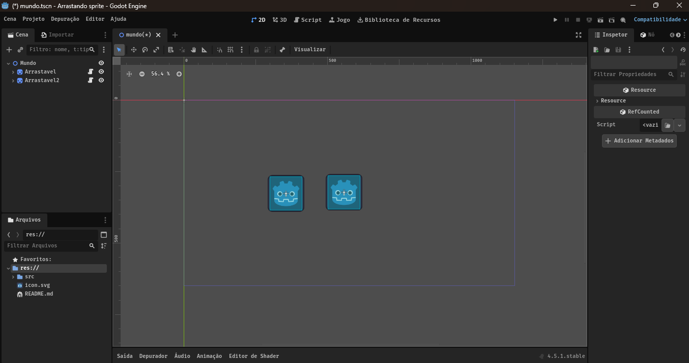
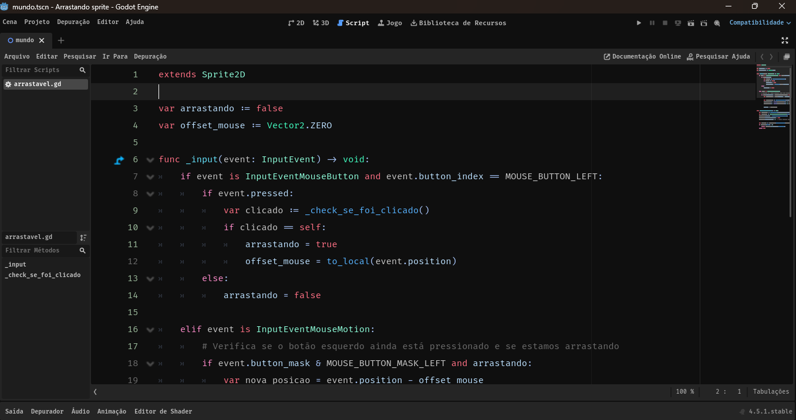
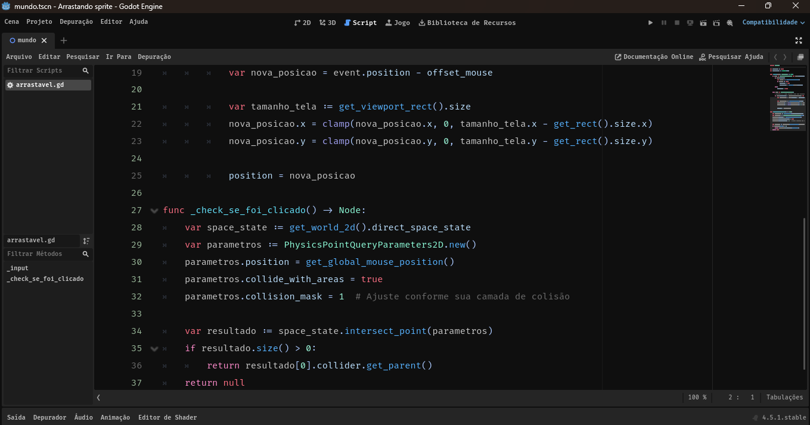

## 🖱️Principais Eventos do Mouse na Godot Engine

Este projeto tem como objetivo demonstrar como o domínio dos eventos de entrada na Godot Engine pode tornar o desenvolvimento de jogos mais simples, eficiente e seguro. Ao aplicar boas práticas de verificação e controle de entrada, é possível evitar falhas comuns que, embora não causem erros imediatos, podem gerar bugs difíceis de rastrear em projetos maiores e mais complexos.

## 📑Índice
 - <a href="#layout">Layout</a>
 - <a href="#executar">Como executar este projeto?</a>
 - <a href="#tecnologias">Tecnologias</a>

## 🧩Layout
 

 

 

## Como executar este projeto?

```bash
# Clone este repositório
$ git clone https://github.com/JonasRdeveloper/Arrastando-Sprites-2D.git

# Acesse a pasta do projeto no seu terminal
$ cd Arrastando-Sprites-2D/

# Escanei o projeto com a Godot Engine e clique no botão editar... pronto!

```

## 🛠️Tecnologias
 - [Godot Engine - Site Oficial](https://godotengine.org/)
